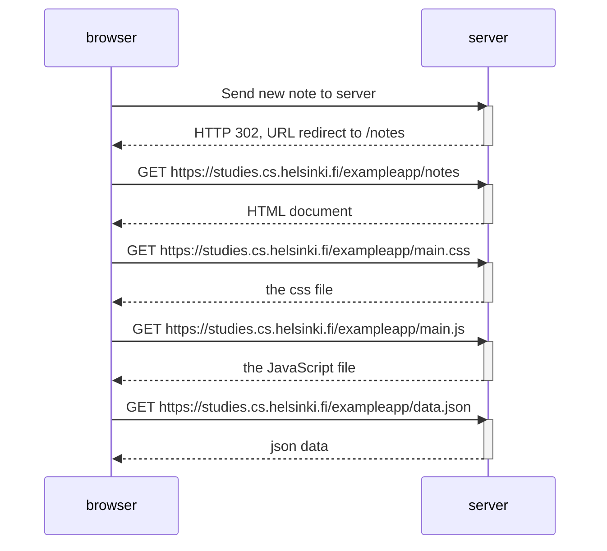
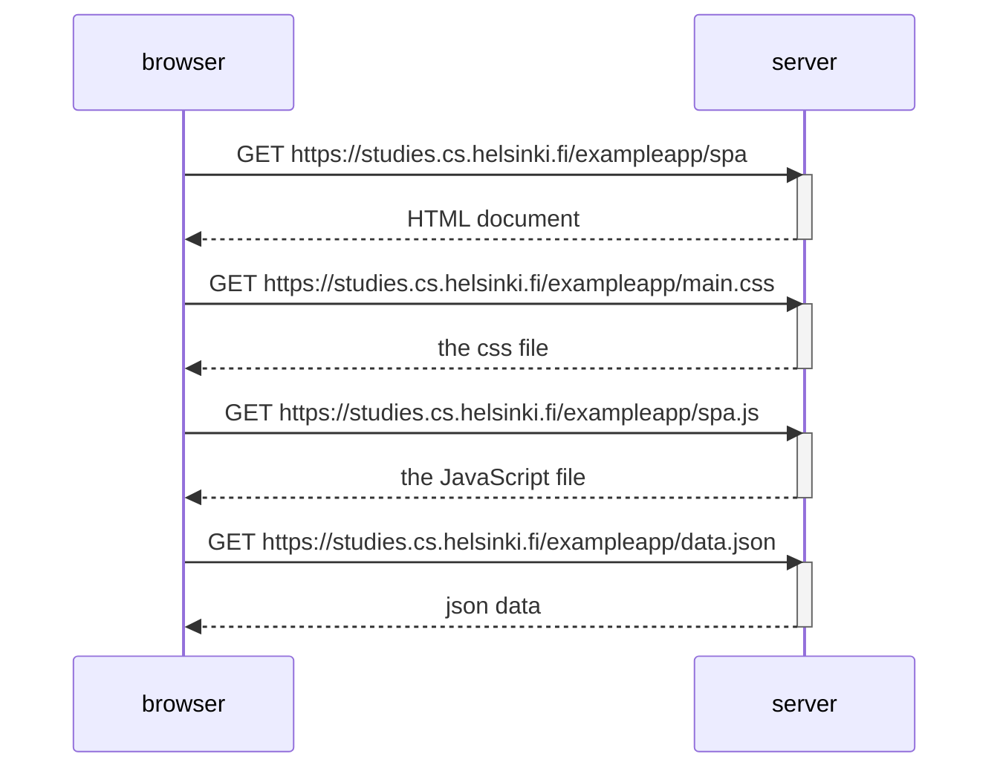
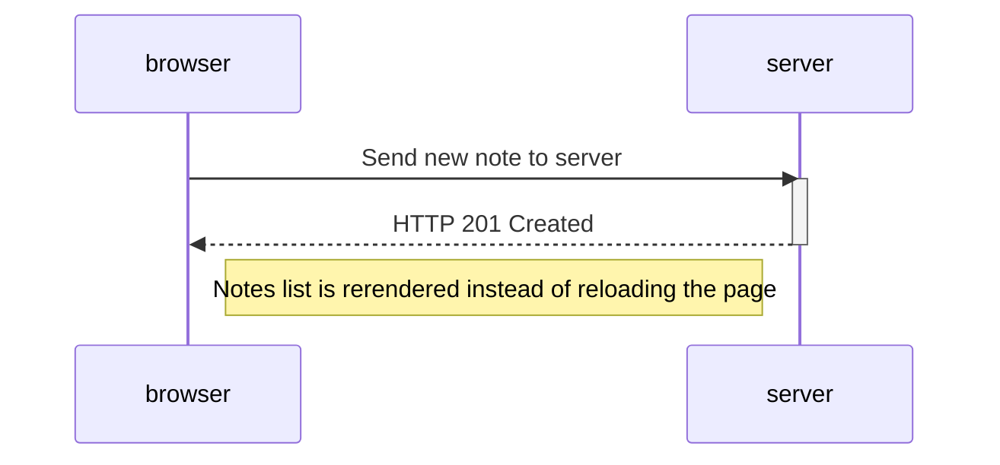

## Exercise 0.4

Creating a new note on the "old" version of the notes app

## Exercise 0.5

Loading the SPA version of the notes app

## Exercise 0.6

Creating a new note on the SPA version of the notes app

